```{r setup, include=FALSE}
knitr::opts_chunk$set(echo = FALSE, cache=TRUE)
#knitr::opts_chunk$set(echo = FALSE)
library(fitdistrplus)
library(ggplot2)
library(reshape2)
#library(plotly)
library(knitr)
library(pandoc)
library(gridExtra)
library(gtools)
library(stats4)
library(rmutil)
library(scales)
library(tidyr)
library(rmutil)
library(invgamma)
library(tidyverse)
library(RColorBrewer)
library(ggsci)
library(ggpubr)
library(patchwork)
library(dplyr)
#options(kableExtra.latex.load_packages = FALSE)
#library(devtools)
#devtools::install_github("haozhu233/kableExtra")
library(kableExtra)
library(ggthemes)
library(latex2exp)
library(e1071)# kurtosis
library(viridis)
library(nortest)# AD
#library(MASS)#
# model selection AIC and BIC


theme_set(theme_minimal() +
            theme(text=element_text(family="serif"),
                  legend.position = "bottom")#  top , right , bottom , or left#, panel.grid = element_blank()
)


source("../Code/R/MainFunctions/gamma_sar_sample.R")
source("../Code/R/MainFunctions/entropy_gamma_sar.R")
source("../Code/R/MainFunctions/entropy_gI0.R")
source("../Code/R/MainFunctions/gi0_sample.R")

source("../Code/R/MainFunctions/van_es_estimator.R")
source("../Code/R/MainFunctions/correa_estimator.R")
source("../Code/R/MainFunctions/bootstrap_correa_estimator_log_mean.R")
source("../Code/R/MainFunctions/ebrahimi_estimator.R")
source("../Code/R/MainFunctions/noughabi_arghami_estimator.R")
source("../Code/R/MainFunctions/vasicek_estimator.R")
source("../Code/R/MainFunctions/al_omari_1_estimator.R")
source("../Code/R/MainFunctions/al_omari_2_estimator.R")

source("../Code/R/MainFunctions/bootstrap_van_es_estimator.R")
source("../Code/R/MainFunctions/bootstrap_correa_estimator.R")
source("../Code/R/MainFunctions/bootstrap_ebrahimi_estimator.R")
source("../Code/R/MainFunctions/bootstrap_noughabi_arghami_estimator.R")
source("../Code/R/MainFunctions/bootstrap_vasicek_estimator.R")
source("../Code/R/MainFunctions/bootstrap_al_omari_1_estimator.R")
source("../Code/R/MainFunctions/bootstrap_al_omari_2_estimator.R")
#The next function contains the functions: generate_samples, calculate_bias_mse, generate_plot
source("../Code/R/Programs/functions_sample_bias_mse.R")# read_ENVI_images
source("../Code/R/Programs/read_ENVI_images.R")


```


\newcommand{\bias}{\operatorname{Bias}}
\newcommand{\widebar}[1]{\overline{#1}}


# Introduction {#sec:Introduction}

Synthetic Aperture Radar (SAR) technology has become an important tool for environmental monitoring and disaster management. It provides valuable images under various conditions, including day or night and different weather situations&nbsp;\cite{Moreira2013,Mu2019}.
However, the effective use of SAR data depends on a thorough understanding of their statistical properties because they are corrupted by speckle.
This noise-like interference effect is inherent in SAR data due to the coherent nature of the imaging process&nbsp;\cite{Argenti2013}.

Speckle is non-Gaussian speckle, thus SAR data require reliable statistical models for accurate processing. 
The $\mathcal{G}^0$ distribution, which is suitable for SAR data, includes the
Gamma law as the limiting case for fully-developed speckle&nbsp;\cite{Ferreira2020} and provides flexibility with fewer parameters for analysis.

Our work aims to improve the identification of potential roughness features in SAR intensity data.
<!-- ACF The following sentence is misleading: the gamma law is a consequence of infinitely many backscatterers with none dominating the return, not the other way aroud. Rephrase. -->
Physical modeling of SAR data allows to take advantage of the gamma distribution in the presence of fully-developed speckle and to create a scenario with an infinite number of independent backscatterers per resolution unit, often referred to as homogeneous regions.

In this context, we present a set of three novel test statistics that aim to distinguish between homogeneous and non-homogeneous return, in particular between gamma and \(\mathcal{G}^0\) distributed data, assuming the number of looks is known. 
We use properties such as entropy and coefficient of variation.

Entropy is a fundamental concept in information theory with far-reaching applications in pattern recognition, statistical physics, image processing, edge detection and SAR image analysis&nbsp;\cite{Presse2013,MohammadDjafari2015,Avval2021, Nascimento2014,Nascimento2019}. 
Shannon introduced it in 1948&nbsp;\cite{Shannon1948} for a random variable as a measure of information and uncertainty.
In statistics, Shannon entropy is a crucial descriptive parameter, especially for evaluating data dispersion and performing tests for normality, exponentiality and uniformity&nbsp;\cite{Wieczorkowski1999,Zamanzade2012}. 
Entropy estimation is associated with some practical difficulties, especially when the model is unknown. In these cases, non-parametric methods are used.
Spacing methods have been discussed as a non-parametric approach in&nbsp;\cite{AlizadehNoughabi2010,Subhash2021}. This strategy provides the flexibility to consider a wide range of models without enforcing certain parametric constraints.

The coefficient of variation (CV), introduced in 1896 by Pearson&nbsp;\cite{Pearson1896}, is a relative dispersion measure widely used in various fields of applied statistics, including sampling, biostatistics, medical and biological research, climatology and other fields&nbsp;\cite{hendricks1936sampling,Tian2005,SubrahmanyaNairy2003,Chankham2024}.
It facilitates the comparison of variability between different populations and is particularly valuable for comparing variables with different units. 
This is because when the main purpose is to compare the variations of several variables, the standard deviation can only serve as an adequate measure of variation if all variables are expressed in the same unit of measurement and have identical means. 
If these conditions are not met for the variables under investigation, the CV is the relative measure that is usually used in real applications. The variable with the highest CV value is the one with the largest relative dispersion around the mean value&nbsp;\cite{Banik2011}.

In our study, entropy serves as a fundamental parameter that allows a robust evaluation using a bootstrapped nonparametric estimator of the Shannon entropy.
At the same time, we use the classical CV and an alternative form based on the ratio between the median absolute deviation and the median. 
The CV is known as an efficient and robust index for texture information and measures the homogeneity of the image&nbsp;\cite{Lopes1990}.
Applying these test statistics to generate maps of \(p\) values facilitates testing the homogeneity hypothesis and reveals different types of targets in the SAR data. 
Through extensive experiments with real and simulated SAR data, we demonstrate the superiority of our proposed method over existing approaches.

Applying these test statistics to generate $p$-value maps facilitates testing of the homogeneity hypothesis, revealing diverse types of targets within the SAR data. 
Through extensive experimentation involving real and simulated SAR data, we demonstrate the superiority of our proposed methodology over existing approaches.


The article is structured as follows: Section&nbsp;\ref{sec:Background}
deals with statistical modeling and entropy estimation for intensity SAR
data. 
Section&nbsp;\ref{sec:test} outlines hypothesis tests based on nonparametric entropy estimators and coefficients of variation. 
In Section&nbsp;\ref{sec:Results} we present experimental results. 
Finally, in Section&nbsp;\ref{sec:conclusion} the conclusions are presented.

# Background {#sec:Background} 

## Statistical Modeling of Intensity SAR data 

The primary models used for intensity SAR data include the Gamma and $\mathcal{G}_I^0$  distributions&nbsp;[@Frery1997]. 
The first is suitable for fully-developed speckle and is a limiting case of the second model, which is interesting due to its versatility in accurately representing regions with different roughness properties&nbsp;[@Cassetti2022].
We denote $Z \sim \Gamma_{\text{SAR}}(L, \mu)$ and $Z \sim \mathcal{G}_I^0(\alpha, \gamma, L)$ to indicate that $Z$ follows the distributions characterized by the respective probability density
functions (pdfs): 
\begin{align}
    f_Z(z;L, \mu)&=\frac{L^L}{\Gamma(L)\mu^L}z^{L-1}\exp\left\{-Lz/\mu\right\} \mathbbm 1_{\mathbbm R_+}(z)\label{E:gamma1}\\
    \intertext{ and }
    f_Z(z; \alpha, \gamma, L)&=\frac{L^L\Gamma(L-\alpha)}{\gamma^{\alpha}\Gamma(-\alpha)\Gamma(L)}\cdot\frac{z^{L-1}}{(\gamma+Lz)^{L-\alpha}} \mathbbm 1_{\mathbbm R_+}(z),\label{E:gi01}
\end{align} 
where \(\mu > 0\) is the mean, \(\gamma > 0\) is the scale, \(\alpha < -1\) measures
the roughness, \(L \geq 1\) is the number of looks, \(\Gamma(\cdot)\) is
the gamma function, and \(\mathbbm 1_{A}(z)\) is the indicator function
of the set \(A\).

If we take the law with the density&nbsp;\eqref{E:gi01}, the \(r\)th non-central moment of \(Z\) is expressed as follows:
\begin{align}
    E_{G_I^0}\left(Z^r\right)=\left(\frac{\gamma}{L}\right)^r\frac{\Gamma(-\alpha-r)}{\Gamma(-\alpha)}\cdot\frac{\Gamma(L+r)}{\Gamma(L)}, \quad \alpha <-r. 
    \label{E:rmom}
\end{align}
 
Although the \(\mathcal{G}_I^0\) distribution is defined by the parameters \(\alpha\) and \(\gamma\), in the SAR literature&nbsp;\cite{Nascimento2010} the texture \(\alpha\) and the mean \(\mu\) are usually used. In this way, we calculate the expected value \(\mu\) using the expression in&nbsp;\eqref{E:rmom}, and we reparametrize&nbsp;\eqref{E:gi01} with \(\mu\),
\(\alpha\), and \(L\).
Then \begin{align*}
    \mu=\left(\frac{\gamma}{L}\right)\frac{\Gamma(-\alpha-1)}{\Gamma(-\alpha)}\cdot\frac{\Gamma(L+1)}{\gamma(L)}=-\frac{\gamma}{\alpha+1}.
\end{align*} 
The reparametrized pdf that characterizes the law \(G_I^0(\mu, \alpha, L)\) is thus
\begin{equation}
        f_Z(z; \mu, \alpha, L)=\frac{L^L\Gamma(L-\alpha)}{\big[-\mu(\alpha+1)\big]^{\alpha}\Gamma(-\alpha)\Gamma(L)} \frac{z^{L-1}}{\big[-\mu(\alpha+1)+Lz\big]^{L-\alpha}}.\label{E:gi02}
\end{equation}

## The Shannon Entropy
The parametric representation of Shannon entropy for a system described by a continuous random variable is:
\begin{equation}
  \label{E:entropy2}
  H(Z)=-\int_{-\infty }^\infty \ f(z)\ln f(z)\, \mathrm{d}z,
\end{equation}
here, \(f(\cdot)\) is the pdf that characterizes the distribution of the real-valued random variable \(Z\).

Using&nbsp;\eqref{E:entropy2}, we can express the Shannon entropy of $\Gamma_{\text{SAR}}$in&nbsp;\eqref{E:gamma1} and $G_I^0$ in&nbsp;\eqref{E:gi02} based on&nbsp;\cite{Cassetti2022} and&nbsp;\cite{Ferreira2020}:
\begin{equation}
\label{E:E-gamma}
H_{\Gamma_{\text{SAR}}}(L, \mu) =   L -\ln L+\ln\Gamma(L)+(1-L)\psi^{(0)}(L) + \ln \mu, 
\end{equation}
\begin{multline}
\label{E:E-GIO}
H_{G_I^0}(\mu, \alpha, L) =L -\ln L+\ln\Gamma(L)+(1-L)\psi^{(0)}(L) +\ln \mu -\ln\Gamma(L-\alpha)\\
+ (L-\alpha) \psi^{(0)}(L-\alpha)-(1-\alpha)\psi^{(0)}(-\alpha)+\ln (-1-\alpha)+\ln\Gamma(-\alpha)-L,
\end{multline}
where $\psi^{(0)}(\cdot)$ is the digamma function. Figure&nbsp;\ref{fig:Plot_GI0_to_gamma1}, shows the behavior of the entropy of \(G_I^0\) when \(\alpha \in \left\{-\infty, -20, -8, -3\right\}\), where the approximation to the entropy of \(\Gamma_{\text{SAR}}\) can be observed when \(\alpha\) assumes large negative values.
In an interpretative sense, we can conclude that the more heterogeneous (high values of $\alpha$) the SAR region is, the higher the value of entropy (or degree of disorder).
It is worth noting that this conclusion confirms what is written in the SAR literature.


```{r Plot_GI0_to_gamma1, echo=FALSE, message=FALSE, warning=FALSE, out.width="70%", fig.show="hold", fig.pos="hbt", fig.cap="$H_{ G_I^0}$ converges to the $H_{\\Gamma_{\\text{SAR}}}$ with $L=8$."}


L <- c(8)
alphas <- c(  -3, -8, -20, -1000)
alpha_labels <- c( expression(italic(alpha) == -3), expression(italic(alpha) == -8), expression(italic(alpha) == -20), expression(italic(alpha) == -1000))

mu <- seq(0.1, 10, length.out = 500)

# Entropy GI0

muEntropy <- data.frame()

for (alpha in alphas) {
  entropies_GI0 <- sapply(L, function(L) entropy_gI0(mu, alpha, L))
  muEntropy <- rbind(muEntropy, data.frame(mu = mu, Entropy = entropies_GI0, alpha = as.factor(alpha)))
}

muEntropy.molten <- melt(muEntropy, id.vars = c("mu", "alpha"),  value.name = "Entropy")

# Entropy Gamma SAR

entropies_gamma <- sapply(L, function(L) entropy_gamma_sar(L, mu))

Entropy_gamma <- data.frame(mu, entropies_gamma)

Entropy_gamma.molten <- melt(Entropy_gamma, id.vars = "mu", value.name = "Entropy Gamma")

#plot

ggplot(muEntropy.molten, aes(x = mu, y = Entropy, col = alpha)) +
  geom_line(data = Entropy_gamma.molten, aes(x = mu, y = `Entropy Gamma`), color = "blue", linetype = "solid",linewidth = 1.5) + 
  geom_line(linetype = "longdash",  linewidth = 2, alpha=.7) +
  annotate("text", x = max(mu)+0.2, y = max(Entropy_gamma.molten$`Entropy Gamma`), 
           label = TeX("$\\Gamma_{\\tiny{SAR}}$"), vjust = 0.9, hjust = 0.1, color = "blue")+
  theme_minimal() +
  scale_color_manual(values = brewer.pal(7, "Dark2")[1:5], labels = alpha_labels) +
  #scale_color_manual(values = pal_jama()(7)[2:5], labels = alpha_labels) +
  #scale_color_manual(values = 	pal_cosmic()(7)[1:5], labels = alpha_labels) +
  labs(col = "Roughness", linetype = NULL) +
  xlab(expression(paste(mu))) +
  ylab("Entropy") +  
  theme(text = element_text(family = "serif"),
        legend.position = "bottom")


```

## Estimation of the Shannon Entropy

The problem of non-parametric estimating of $H(Z)$ has been considered by many authors including&nbsp;\cite{vasicek1976test, Wieczorkowski1999,correa1995new,AlOmari2019}, who have proposed estimators based on spacings.

One of the first non-parametric estimators based on spacings was introduced by Vasicek&nbsp;\cite{vasicek1976test}. 
Under the assumption that \(\bm{Z}=(Z_1, Z_2,\ldots,Z_n)\) is a random sample from the distribution \(F(z)\), the estimator is defined as:
\begin{equation*}
\label{E:Vas}
	\widehat{H}_{\text{V}}(\bm{Z})=\frac{1}{n}\sum_{i=1}^{n}\ln\left[\frac{n}{2m}\left(Z_{(i+m)}-Z_{(i-m)}\right)\right],
	\end{equation*}
where $m<n/2$ is a positive integer, $Z_{(i+m)}-Z_{(i-m)}$ is the $m$-spacing and $Z_{(1)}\leq Z_{(2)}\leq\ldots\leq Z_{(n)}$ are the order statistics and $Z_{(i)}= Z_{(1)}$ if $i<1$, $Z_{(i)}= Z_{(n)}$ if $i>n$.

Several authors have explored adaptations to Vasicek's estimator. 
We consider three estimators known for their superior performance&nbsp;\cite{Cassetti2022}:
Correa&nbsp;\cite{correa1995new}, \(\widehat{H}_{\text{C}}\);
Ebrahimi et al&nbsp;\cite{Ebrahimi1994}, \(\widehat{H}_{\mathrm{E}}\);
and Al Omary&nbsp;\cite{IbrahimAlOmari2014}, \(\widehat{H}_{\mathrm{AO}}\).

## Enhanced Bootstrap Technique

We use the bootstrap technique to refine the accuracy of existing nonparametric entropy estimators. In this approach, new data sets are generated by replicate sampling from an existing data set&nbsp;\cite{Michelucci2021}.

Let us assume that non-parametric entropy estimators
\(\widehat{H}=\widehat{\theta}(\bm{Z})\) are inherently biased, i.e:\begin{equation}
\label{Eq:bias1}
\operatorname{Bias}\big(\widehat{\theta}(\bm{Z})\big) = E\big[\widehat{\theta}(\bm{Z})\big] - \theta \neq 0.
\end{equation} Our bootstrap-improved estimators are of the form:
\begin{align*}
\widetilde{H} &= 2\widehat{\theta}(\bm{Z}) - \frac{1}{B}\sum_{b=1}^B \widehat{\theta}_b(\bm{Z}^{(b)}),
\end{align*} 
where \(B\) is the number of replications in the bootstrap
technique. 
Applying this methodology, the original estimators of Correa,
Ebrahimi and Al-Omari are now referred to as the proposed bootstrap-enhanced versions:
\(\widetilde{H}_{\text{C}}\),
\(\widetilde{H}_{\text{E}}\), and \(\widetilde{H}_{\text{AO}}\),
respectively.


We analyzed the performance of these estimators with a Monte Carlo study: \(500\) samples of \(G_I^0\) of size
\(n\in\left\{9, 25, 49, 81, 121\right\}\) and different values for mean, number of looks and roughness. We present the results with
\(\mu\in\left\{1, 10\right\}\), \(\alpha=-10\) and \(L=5\). The results are also adherent for the other situations. In the bootstrap technique, each sample is replicated a hundred times with replacement. We use the following heuristic formula for spacing,
\(m=\left[\sqrt{n}+0.5\right]\).

In Figure&nbsp;\ref{fig:Plot_bias_mse_gi0} we show comparisons of bias and mean squared error (MSE) between the original non-parametric entropy estimators and their respective bootstrap-enhanced versions. The use of the bootstrap technique shows higher precision, lower bias and MSE, and improved convergence. The results of the simulation can be found in
Table&nbsp;\ref{tab:table2}.

The precision of the estimators resulting from the comparison of bias and MSE benefits significantly from the bootstrap technique, especially for sample sizes below 81.


```{r Simulated_data_gi0, echo=FALSE, message=FALSE}

set.seed(1234567890, kind = "Mersenne-Twister")
sample_sizes <- c(9, 25, 49, 81, 121 )

# Number of replications
R <-300

# Number of bootstrap replications
B1 <- 20
mu_values <- c(1, 10)
alpha <- -20
L <- 5

estimators <- list(
  "Correa" = correa_estimator,
  "Ebrahimi" = ebrahimi_estimator,
  "Al Omari" = al_omari_1_estimator,
  "Correa Bootstrap" = bootstrap_correa_estimator,
  "Ebrahimi Bootstrap" = bootstrap_ebrahimi_estimator,
  "Al Omari Bootstrap" = bootstrap_al_omari_1_estimator
)


calculate_results_gi0 <- function(sample_sizes, R, B1, mu_values, alpha, L, estimators) {
  results_list <- list()

  for (mu_val in mu_values) {
    
    results <- calculate_bias_mse_gi0(sample_sizes, R, B1, mu_val, alpha, L, estimators)
    df <- as.data.frame(results)

    
    results_list[[as.character(mu_val)]] <- df
  }

  return(results_list)
}


results_gi0 <- calculate_results_gi0(sample_sizes, R, B1, mu_values, alpha, L, estimators)


save(results_gi0, file = "./Data/resultsgi0_1.Rdata")


```


```{r Plot_bias_mse_gi0, echo=FALSE, message=FALSE, warning=FALSE, out.width="80%", fig.pos="hbt",  fig.cap="Bias and MSE, $L=5$ and  $\\alpha=-10$.", fig.width=8, fig.height=5.5}


load("./Data/resultsgi0_1.Rdata")


estimators_to_plot <- c("Correa", "Ebrahimi", "Al Omari",  "Correa Bootstrap", "Ebrahimi Bootstrap", "Al Omari Bootstrap" )
  latex_estimator_names <- c("Correa" = expression("$\\widehat{italic(H)}_{C}$"),
                             "Correa Bootstrap" = expression("$\\widetilde{italic(H)}_{C}$"),
                            "Ebrahimi" = expression("$\\widehat{italic(H)}_{E}$"),
                            "Al Omari" = expression("$\\widehat{italic(H)}_{AO}$"),
                            "Ebrahimi Bootstrap" = expression("$\\widetilde{italic(H)}_{E}$"),
                            "Al Omari Bootstrap" = expression("$\\widetilde{italic(H)}_{AO}$"))
selected_estimators_latex <- latex_estimator_names[estimators_to_plot]


combined_plot_gi0 <- generate_plot_gi0_esp(results_gi0, mu_values, selected_estimators_latex, ncol = 1, nrow = 2)


print(combined_plot_gi0)


```


```{r Table_gi0, echo=FALSE, message=FALSE, warning=FALSE, results='asis'}
#cat("\\setlength{\\tabcolsep}{0.5pt}\n")
load("./Data/resultsgi0_1.Rdata")

# Define estimators
estimators_to_table <- c( "Al Omari","Correa", "Ebrahimi", "Al Omari Bootstrap",  "Correa Bootstrap","Ebrahimi Bootstrap")

# Filter and reshape data
filtered_results <- purrr::map_dfr(results_gi0, ~ .x %>% filter(Estimator %in% estimators_to_table), .id = "mu")

reshaped_results <- filtered_results %>%
  pivot_wider(names_from = Estimator, values_from = c(Bias, MSE))

colnames(reshaped_results) <- c("$\\mu$", "$n$", "$\\widehat{H}_{\\text{AO}}$", "$\\widehat{H}_{\\text{C}}$", "$\\widehat{H}_{\\text{E}}$", "$\\widetilde{H}_{\\text{AO}}$", "$\\widetilde{H}_{\\text{C}}$", "$\\widetilde{H}_{\\text{E}}$",  "$\\widehat{H}_{\\text{AO}}$", "$\\widehat{H}_{\\text{C}}$", "$\\widehat{H}_{\\text{E}}$","$\\widetilde{H}_{\\text{AO}}$", "$\\widetilde{H}_{\\text{C}}$", "$\\widetilde{H}_{\\text{E}}$")


reshaped_results[] <- lapply(reshaped_results, function(x, col_name) {
  if (is.numeric(x)) {
    if (col_name == "\\mu") {
      formatted_numbers <- sprintf("$\\scriptstyle %d$", x)
    } else {
      if (all(x %% 1 == 0)) {
        formatted_numbers <- sprintf("$%d$", x)
      } else {
        formatted_numbers <- ifelse(x < 0, sprintf("$%.3f$", x), sprintf("$\\phantom{-}%.3f$", x))
      }
    }
    return(formatted_numbers)
  } else {
    return(x)
  }
}, col_name = names(reshaped_results)[1])  


#print(
 # kbl(
knitr::kable(
    reshaped_results,
    caption = "Bias and MSE of non-parametric entropy estimators and bootstrap versions.",
    format = "latex",
    booktabs = TRUE,
    align = "lrrrrrrrrrrrrrrr",
    escape = FALSE, 
    digits = 2,  
    label = "table2",
    centering = FALSE,
    table.envir = "table", position = "H") %>%
    add_header_above(c(" ", " ", "Bias" = 6,  "MSE" = 6)) %>%
    collapse_rows(columns = 1:2, latex_hline = "major", valign = "middle") %>%
    row_spec(0,  align = "c")%>%
    kable_styling(latex_options = "scale_down")
  #)
  #kable_styling(latex_options = c("scale_down"))

```


## Coefficient of variation and a robust alternative

The population CV is defined as a ratio of the population standard deviation $(\sigma)$ to the population mean $(\mu)$:
\begin{align}
	\text{CV}=\frac{\sigma}{\mu}, \quad \mu \neq 0.
\end{align}

We explore a robust alternative to CV, as described in&nbsp;\cite{Ospina2019}, which incorporates the ratio between the mean absolute deviation from the median (MnAD) and the median, two well-known robust measures of
scale and location, respectively. The sample version for the MnAD is defined as
\(n^{-1}\sum_{i=1}^n|x_i-\widehat{Q}_2|\), where \(\widehat{Q}_2\)
is an estimate for the median of the population, which can be approximated by the median of the sample.

  
  
# Hypothesis Testing  {#sec:test}


We aim at testing the following hypotheses: 

$$
 \begin{cases}\mathcal{H}_0: \text{ The data comes from the } \Gamma_{\text{SAR}}\\ 
  \mathcal{H}_1:\text{ The data comes from the } G_I^0.\end{cases}
$$
In the physical sense, we are testing the hypothesis that the data are fully-developed speckle.
As for the parametric problem, once it is not possible to define the hypothesis $\mathcal{H}_0=\alpha=-\infty$, it is impossible to solve this problem with the parametric statistical inference alternatives (such as likelihood ratio, score, grandient and Wald hypothesis test).
The proposed tests to solve this physical problem in SAR systems are described below.

## The Proposed Test Based on Non-parametric Entropy

The first test statistic evaluates the behavior of the data under the null hypothesis using the empirical distribution: 
\begin{equation}
\label{Eq:test_e}
S_H= \widetilde{H}-\left[H_{\Gamma_{\text{SAR}}}(L)+\ln \widebar{Z}\right].
\end{equation}
The values should be around zero under the null hypothesis and far otherwise. 
<!-- This suggests significant differences and implies the presence of heterogeneous clutter. -->
Figure&nbsp;\ref{fig:Plot_density} shows the empirical test statistic densities for different sample sizes, and Table&nbsp;\ref{tab:table_stat_combined} summarizes the main descriptive statistics, including mean, SD, variance (Var), skewness (SK), excessive kurtosis (EK) and Anderson--Darling \(p\) values for normality. 
Results with \(p\) values greater than \(0.05\) do not indicate a violation of the normality assumption. A low variance as well as a skewness and an excessive kurtosis of almost zero indicate limited dispersion, symmetry and a slight tail.
Normal QQ plots confirm that there is no evidence against a normal distribution, as shown in Figure&nbsp;\ref{fig:Plot_normality_qq}.

```{r Simulated_density, echo=FALSE, message=FALSE}
#, cache = TRUE, autodep = TRUE
set.seed(1234567890, kind = "Mersenne-Twister")

R <- 2000
mu <- 1
B <- 2

sample.size <- c(25,49, 81, 121)
L_values <- c(3,  5, 8, 11)

all_summary_stats <- list()
all_TestStatistics <- list()


# For each L
for (L in L_values) {
  TestStatistics1 <- list()  
  summary_stats <- data.frame( LValue = character(),
                              SampleSize = numeric(),
                              Mean = numeric(),
                              SD = numeric(),
                              Variance = numeric(),
                              #CV= numeric(),
                              Skewness = numeric(),
                              Kurtosis = numeric(),
                              adpvalue = numeric()
                              )  
 
  
  for (s in sample.size) {
    TestStat1 <- numeric(R)
    
    for (r in 1:R) {
      z <- gamma_sar_sample(L, mu, s)
      #z <- gi0_sample(mu, alpha1, L, s)
      TestStat1[r] <- bootstrap_correa_estimator_log_mean(z, B) + (-L + log(L) - lgamma(L) - (1 - L) * digamma(L))
    }
    
    TestStatistics1[[as.character(s)]] <- data.frame("SampleSize" = rep(s, R), "Test_Statistics" = TestStat1)
    

    
   
    mean_val <- mean(TestStat1)
    sd_val <- sd(TestStat1)
    var_val <- var(TestStat1)
    skewness_val <- skewness(TestStat1)
    kurtosis_val <- kurtosis(TestStat1)
   # lillie_p_value <- lillie.test(TestStatistics1[[as.character(s)]]$Test_Statistics)$p.value
    ad_p_value <- ad.test(TestStatistics1[[as.character(s)]]$Test_Statistics)$p.value
    #cv_val <- abs(sd_val / mean_val)
    
    summary_stats <- rbind(summary_stats, data.frame(LValue = as.character(L),
                                                     SampleSize = s,
                                                     Mean = mean_val,
                                                     SD = sd_val,
                                                     Variance = var_val,
                                                      #CV = cv_val,
                                                     Skewness = skewness_val,
                                                     Kurtosis = kurtosis_val,
                                                     adpvalue = ad_p_value
                                                     )) 
  
  }
  
  all_TestStatistics[[as.character(L)]] <- TestStatistics1
  all_summary_stats[[as.character(L)]] <- summary_stats
  
  

  save(all_TestStatistics, all_summary_stats, file = paste0("./Data/results1_", L, ".Rdata"))
}


```

```{r Plot_density, echo=FALSE, message=FALSE, warning=FALSE, out.width="80%", fig.pos="hbt",  fig.cap="Empirical density  under the null hypothesis.", fig.width=6, fig.height=5.0}

theme_set(theme_minimal() +
            theme(text = element_text(family = "serif"),
                  legend.position = "bottom",
                  legend.text = element_text(angle = 0, vjust = 0.5)))

all_plots <- list()

for (L in L_values) {
  load(paste0("./Data/results1_", L, ".Rdata"))

  combined_data <- do.call(rbind, all_TestStatistics[[as.character(L)]])
  combined_data$L <- L

  p <- ggplot(combined_data, aes(x = Test_Statistics, col = factor(SampleSize), linetype = factor(SampleSize))) +
    geom_line(stat = "density", linewidth = 1.0) +
    scale_color_viridis(discrete = TRUE, option = "C", direction = -1, begin = 0.1, end = 0.8, name = "Sample Size") +
    scale_linetype_manual(values = rep("solid", length(sample.size)), name = "Sample Size") +
    labs(x = "Test Statistics", y = "Density") +
    ggtitle(bquote(italic(L) == .(L))) +
    theme(plot.title = element_text(hjust = 0.5))#titulo centrado

  if (!any(L == L_values)) {
    p = p
  }

  all_plots[[as.character(L)]] <- p
}

combined_plot <- wrap_plots(all_plots, ncol = 2, nrow = 2) +
  plot_layout(guides = "collect")

print(combined_plot)


```


```{r Table_statistic, echo=FALSE, message=FALSE, warning=FALSE, results='asis'}

#cat("\\setlength{\\tabcolsep}{1.0pt}\n")

load("./Data/results1_3.Rdata")
summary_stats_2 <- all_summary_stats[["3"]]


load("./Data/results1_5.Rdata")
summary_stats_5 <- all_summary_stats[["5"]]


load("./Data/results1_8.Rdata")
summary_stats_8 <- all_summary_stats[["8"]]

load("./Data/results1_11.Rdata")
summary_stats_11 <- all_summary_stats[["11"]]

combined_summary_stats <- rbind(
  transform(summary_stats_2),
  transform(summary_stats_5),
  transform(summary_stats_8),
  transform(summary_stats_11)
  
)
colnames(combined_summary_stats) <- c("$\\bm{L}$", "$\\bm{n}$", "\\textbf{Mean}", "\\textbf{SD}", "\\textbf{Var}", "\\textbf{SK}", "\\textbf{EK}", "$p$-\\textbf{value}")


# LaTeX notation 
combined_summary_stats[] <- lapply(combined_summary_stats, function(x) {
  if (is.numeric(x)) {
    if (all(x %% 1 == 0)) {
      formatted_numbers <- sprintf("$%d$", x)
    } else {
      formatted_numbers <- ifelse(x < 0, sprintf("$%.4f$", x), sprintf("$\\phantom{-}%.4f$", x))
    }
    return(formatted_numbers)
  } else {
    return(x)
  }
})


table_result_combined <- knitr::kable(
  combined_summary_stats,
  caption = "Descriptive analysis of $S_H$ with $L\\in\\left\\{3,5, 8,11\\right\\}$ and $\\mu=1$.",
  format = "latex",
  booktabs = TRUE,
  align = "lrrrrrrr",
  escape = FALSE,
  digits = 4,
  label = "table_stat_combined",
  centering = FALSE,
  table.envir = "table", position = "H") %>%
  #table.env = 'table*' # to span multiple columns
  collapse_rows(latex_hline = "major", valign = "middle") %>%
  row_spec(0,  align = "c")
  

print(table_result_combined)


```

```{r Plot_normality_qq, echo=FALSE, message=FALSE, warning=FALSE, out.width="80%", fig.pos="hbt",  fig.cap="Normal QQ-plots for  $n=121$.", fig.width=6, fig.height=5}


theme_set(theme_minimal() +
            theme(text = element_text(family = "serif"),
                  legend.position = "bottom",
                  legend.text = element_text(angle = 0, vjust = 0.5)))


# Load saved results
load("./Data/results1_3.Rdata")
load("./Data/results1_5.Rdata")
load("./Data/results1_8.Rdata")
load("./Data/results1_11.Rdata")

# Specific sample size
selected_sample_size <- 121

# 
ggplot_list <- list()

#  L
for (L in c(3, 5, 8, 11)) {
  TestStatistics1 <- all_TestStatistics[[as.character(L)]]
  
  # 
  if (as.character(selected_sample_size) %in% names(TestStatistics1)) {
    p <- ggplot(TestStatistics1[[as.character(selected_sample_size)]], 
                aes(sample = Test_Statistics)) +
      geom_qq(col = "blue", shape = 20) +
      geom_qq_line(col = "darkgreen", linetype = 2) +
      labs(title = bquote(italic(L) == .(L)),
           x = "Theoretical Quantiles",
           y = "Sample Quantiles") +
      theme(plot.title = element_text(hjust = 0.5))#titulo centrado

    
    ggplot_list[[as.character(L)]] <- p
  } else {
    warning(paste("No size sample", selected_sample_size, " L =", L))
  }
}
combined_plot1 <- wrap_plots(ggplot_list, ncol = 2, nrow = 2) +
  plot_layout(guides = "collect")

print(combined_plot1)


# }


```

After checking the normality of the data, we examined the possibilities of the proposed test in terms of size and power.
Under \(\mathcal{H}_0\), the distribution of the test statistic is asymptotically normal.
Therefore, the \(p\) value is calculated as
\(2\Phi(-\mid \varepsilon\mid)\), where \(\Phi\) is the standard
Gaussian cumulative distribution and \(\varepsilon\) is the standardized test statistic given by :
\[
\varepsilon=\frac{\widetilde{H}-H_{\Gamma_{\text{SAR}}}}{\hat\sigma}.
\]

We have nominal levels of \SI{1}{\ percent}, \SI{5}{\ percent}, and
\SI{10}{\percent}. 
In terms of size, \(1000\) simulations were used for different sample sizes with satisfactory results. 
In all cases, the nominal level was achieved. 
The power generally improves with increasing sample size and number of looks.
The results are shown in Table&nbsp;\ref{tab:table_size_power}.

```{r Simulated_error_type_I, echo=FALSE, message=FALSE}
set.seed(1234567890, kind = "Mersenne-Twister")
# 
calculate_p_value <- function(test_statistic, mu_W, sigma_W, alpha_nominal) {
  epsilon <- test_statistic / sigma_W
  p_value <- 2 * (1 - pnorm(abs(epsilon)))
  
  return(p_value < alpha_nominal)  
}
R <- 1000
mu <- 1
B <- 1
L_values <- c( 3, 5, 8, 11)
sample_sizes <- c( 25, 49, 81, 121)
alpha_nominals <- c(0.01, 0.05, 0.1)
results <- data.frame()
for (L in L_values) {
  for (alpha_nominal in alpha_nominals) {
    TestStatistics <- NULL
    mean_entropy <- numeric(length(sample_sizes))
    sd_entropy <- numeric(length(sample_sizes))
    
    for (s in sample_sizes) {
      TestStat <- numeric(R)
      
      for (r in 1:R) {
        z <- gamma_sar_sample(L, mu, s)
        TestStat[r] <- bootstrap_correa_estimator_log_mean(z, B) - (L - log(L) + lgamma(L) + (1 - L) * digamma(L))
      }
      mean_entropy[sample_sizes == s] <- mean(TestStat)
      sd_entropy[sample_sizes == s] <- sd(TestStat)
      
      TestStatistics <- rbind(TestStatistics, data.frame("L" = rep(L, R), "Sample_Size" = rep(s, R), "Test_Statistics" = TestStat))
    }
    
    mu_W <- mean_entropy
    sigma_W <- sqrt(sd_entropy^2)
    
    p_values <- apply(TestStatistics, 1, function(row) {
      calculate_p_value(row["Test_Statistics"], mu_W[sample_sizes == row["Sample_Size"]], sigma_W[sample_sizes == row["Sample_Size"]], alpha_nominal)
    })
    
    result <- data.frame("L" = TestStatistics$L, "Sample_Size" = TestStatistics$Sample_Size, "Alpha_Nominal" = alpha_nominal, "P_Value" = p_values)
    results <- rbind(results, result)
  }
}
save(results, file = "./Data/type_I_results.Rdata")
```

```{r Simulated_power, echo=FALSE, message=FALSE}
set.seed(1234567890, kind = "Mersenne-Twister")
calculate_p_value <- function(test_statistic, mu_W, sigma_W) {
  epsilon <- test_statistic  / sigma_W
  p_value <- 2 * (1 - pnorm(abs(epsilon)))
  
  return(p_value)
}
calculate_type_II_error_rate <- function(p_values, alpha_nominal) {
  type_II_error_rate <- sum(p_values >= alpha_nominal) / length(p_values)
  return(type_II_error_rate)
}
# Function to calculate power for different L values and alpha_nominals
calculate_power <- function(R, mu, L_values, B, sample_sizes, alpha_nominals) {
  results <- data.frame()
  
  for (L in L_values) {
    for (alpha_nominal in alpha_nominals) {
      TestStatistics <- list()
      mean_entropy <- numeric(length(sample_sizes))
      sd_entropy <- numeric(length(sample_sizes))
      
      for (s in sample_sizes) {
        TestStat <- numeric(R)
        
        for (r in 1:R) {
          z <- gi0_sample(mu, -5, L, s)
          TestStat[r] <- bootstrap_correa_estimator_log_mean(z, B) - (L - log(L) + lgamma(L) + (1 - L) * digamma(L))
        }
        
        mean_entropy[sample_sizes == s] <- mean(TestStat)
        sd_entropy[sample_sizes == s] <- sd(TestStat)
        
        TestStatistics[[as.character(s)]] <- TestStat
      }
      
      mu_W <-  mean_entropy  
      sigma_W <- sqrt(sd_entropy^2)  
      
      p_values <- lapply(TestStatistics, function(TestStat) {
        apply(data.frame("Test_Statistics" = TestStat), 1, function(row) {
          calculate_p_value(row["Test_Statistics"], mu_W, sigma_W[as.numeric(names(TestStatistics)) == as.numeric(s)])
        })
      })
      
      type_II_error_rates <- sapply(p_values, function(p_values_for_size) {
        calculate_type_II_error_rate(p_values_for_size, alpha_nominal)
      })
      
      power <- 1 - type_II_error_rates
      
      result_row <- data.frame(
        L = L,
        alpha_nominal = alpha_nominal,
        Sample_Size = sample_sizes,
        power = power
      )
      
      results <- rbind(results, result_row)
    }
  }
  
  return(results)
}
R <- 1000
mu <- 1
L_values <- c(3, 5,  8, 11)
B <- 1
sample_sizes <- c(25, 49, 81, 121)
alpha_nominals <- c(0.01, 0.05, 0.1)
results_power <- calculate_power(R, mu, L_values, B, sample_sizes, alpha_nominals)
save(results_power, file = "./Data/results_power.Rdata")
```

```{r Table_size_and_power, echo=FALSE, message=FALSE, warning=FALSE, results='asis'}
#cat("\\setlength{\\tabcolsep}{4pt}\n")
load("./Data/type_I_results.Rdata")
type_I_error_rates <- tapply(results$P_Value, INDEX = list(results$L, results$Sample_Size, results$Alpha_Nominal), FUN = function(p_values) {
  sum(p_values) / length(p_values)  
})
type_I_error_results <- as.data.frame(as.table(type_I_error_rates))
colnames(type_I_error_results) <- c("L", "Sample_Size", "Alpha_Nominal", "Type_I_Error_Rate")
spread_results <- spread(type_I_error_results, key = Alpha_Nominal, value = Type_I_Error_Rate)
spread_results <- spread_results %>% 
  select(L, Sample_Size, `0.01`, `0.05`, `0.1`)
load("./Data/results_power.Rdata")
summary_stats <- results_power %>%
  spread(key = alpha_nominal, value = power) %>%
  select(L, Sample_Size, `0.01`, `0.05`, `0.1`)
combined_results <- merge(spread_results, summary_stats, by = c("L", "Sample_Size"))
combined_results <- combined_results %>% 
  arrange(L, Sample_Size)
combined_results <- combined_results %>% 
  select(L, Sample_Size, `0.01.x`, `0.05.x`, `0.1.x`, `0.01.y`, `0.05.y`, `0.1.y`)
colnames(combined_results) <- c("$L$", "$n$", "$1\\%$", "$5\\%$", "$10\\%$", "$1\\%$", "$5\\%$", "$10\\%$")
# LaTeX notation 
combined_results[] <- lapply(combined_results, function(x) {
  if (is.numeric(x)) {
    if (all(x %% 1 == 0)) {
      formatted_numbers <- sprintf("$%d$", x)
    } else {
      formatted_numbers <- ifelse(x < 0, sprintf("$%.4f$", x), sprintf("$\\phantom{-}%.4f$", x))
    }
    return(formatted_numbers)
  } else {
    return(x)
  }
})
table_combined_result <- knitr::kable(
  combined_results,
  caption = "Size and Power of the entropy-based test.",
  format = "latex",
  booktabs = TRUE,
  align = "lcccccccc",
  escape = FALSE,
  digits = 4,
  label = "table_size_power",
  centering = FALSE,
  #linesep = "",
  table.envir = "table", position = "H")%>%
  add_header_above(c(" ", " ", "Size" = 3,  "Power" = 3)) %>%
  collapse_rows(columns = 1:2, latex_hline = "major", valign = "middle") %>%
  row_spec(0,  align = "c")
print(table_combined_result)
```

## The Proposed Test Based on Coefficient of Variation and a Robust Alternative

In addition to the entropy-based test, we also propose a test statistic based on the classical CV. This test statistic is defined as follows:
\begin{align}
	T_{\text{CV}}=\frac{S}{\widebar{Z}},
\end{align}
where $S$ and $\widebar{Z}$ are the sample standard deviation and the sample mean, respectively.


Similarly, we use another test statistic based on the ratio of the MnAD to the median. This statistic is given by:
\begin{align}
	T_{\text{CV}_{\text{MnAD}}}=\frac{\text{MnAD}}{\text{Median}}.
\end{align}
These test statistics allow assessing the variability of the data.

The situations in which the use of CV and \(\text{CV}_{\text{MnAD}}\) may be appropriate, i.e. when the observations are positive, the log-normal
(LN) and the inverse Gaussian distribution (IG) are often more appropriate than the Gamma and Weibull distributions&nbsp;\cite{Chaubey2017,takagi1997application}.

It is shown that the IG distribution is well approximated by the log-normal distribution, which means that the
IG distribution also does not share the problem of the non-existence of a fixed-width confidence interval with the Gaussian case&nbsp;\cite{whitmore1978}.


The LN distribution in two parameters has the following density function.

\begin{align}
    f_Z(z;\mu_{\text{LN}}, \sigma_{\text{LN}} )=\frac{1}{\sigma_{\text{LN}} z\sqrt{2\pi}}\exp\left\{-\frac{(\ln z- \mu_{\text{LN}})^2}{2\sigma_{\text{LN}}^2}\right\}\mathbbm 1_{\mathbbm R_+}(z),
\end{align}  
here, $\mu_{\text{LN}}$ and $\sigma_{\text{LN}}$ are the mean and standard deviation of the logarithm.


## Model Selection Criterion   

Akaike information criterion (AIC) and Bayesian information criterion (BIC) are used to select the best fitting distribution. 

The AIC is a fine technique that deals with the trade-off between the goodness-of-fit of the model and the simplicity of the model in terms of the number of model parameters&nbsp;\cite{Burnham2004}. 
The model or distribution with the lowest value of AIC is chosen to be the best.
The BIC assesses goodness-of-fit of a distribution or model, but avoids overfitting by penalising an additional degree of freedom&nbsp;\cite{Dziak2019}. 
The model with the lowest BIC value is chosen as the best.


The AIC and BIC results in Tables&nbsp;\ref{tab:table_aic_gamma}--\ref{tab:table_aic_gio_MnADmedian} indicate that the CV and \(\text{CV}_{\text{MnAD}}\) data from different distributed gamma and \(G_I^0\) synthetic sample sizes match the properties of an LN distribution.
\textcolor{green}{%
It is important to note that this conclusion was drawn empirically based on a dictionary of distributions that are analytically tractable and well-defined under biparametric, unimodal, asymmetric, and positive distributions.
}

\textcolor{red}{%
ADCN: Caros, esse é o ponto mais delicado da excelente ideia desse paper em minha opinião. Não me oponho a colocarmos a lognormal como uma possibilidade, mas é preciso deixar claro que é uma possibilidade empírica. Uma alternativa empírica para uma solução do momento usando distribuições mais desenvolvidas na literatura e que sejam analiticamente tratáveis. Estou pensando corretamente? Se sim, por que não log-t-student, log-Laplace, power exponential, Log-hyperbolic,.... (e a lista segue). Sugiro talvez indicar (i) a dedução da distribuição assintótica das estatísticas em função de CV e MNAD dando com entrada G0I ($\mathcal{H}_1$) e a Gamma ($\mathcal{H}_0$) como trabalho futuro. Do que eu entendi, a suposição da normal assintótica para entropia vem de uma coleção de trabalhos teóricos. Já a LN, do que percebi, não. Coloquei um comentário em verde. Vejam se estão de acordo.
}


Figures&nbsp;\ref{fig:Plot_cv}--\ref{fig:Plot_madmed_gi0_MnADmedian} show empirical and fitted density plots, Q-Q plots, P-P plots as well as empirical and fitted cumulative distribution functions.
They provide qualitative sources that confirm that the LN distribution is the most appropriate distribution

```{r Simulated_AIC_BIC_gamma, echo=FALSE, message=FALSE, warning=FALSE}
set.seed(1234567890, kind = "Mersenne-Twister")
R <- 15000
mu <- 1
L <- 5
#B <- 5
#alpha1 <- -3
sample.sizes <- c(25, 49, 81, 121)


results_AIC <- data.frame(Test = character(),
                          SampleSize = integer(),
                          Normal = numeric(),
                          Lognormal = numeric(),
                          Gamma = numeric(),
                          Weibull = numeric(),
                          InverseGaussian = numeric())

results_BIC <- data.frame(Test = character(),
                          SampleSize = integer(),
                          Normal = numeric(),
                          Lognormal = numeric(),
                          Gamma = numeric(),
                          Weibull = numeric(),
                          InverseGaussian = numeric())

for (s in sample.sizes) {
  TestStatistics <- numeric(0)
  
  for (r in 1:R) {
    z <- gamma_sar_sample(L, mu, s)
    #z <- gi0_sample(mu, alpha1, L, s)
    TestStat <- sd(z) / mean(z)
    TestStatistics <- c(TestStatistics, TestStat)
  }
  
  fit_weibull <- fitdistr(TestStatistics, "weibull")
  fit_lognormal <- fitdistr(TestStatistics, "lognormal")
  fit_gamma <- fitdistr(TestStatistics, "gamma")
  fit_normal <- fitdistr(TestStatistics, "normal")
  
  AIC_values <- c(AIC(fit_weibull), AIC(fit_lognormal), AIC(fit_gamma), AIC(fit_normal))
  BIC_values <- c(BIC(fit_weibull), BIC(fit_lognormal), BIC(fit_gamma), BIC(fit_normal))
  
  dinvgauss <- function(x, mu, lambda) {
    sqrt(lambda / (2 * pi * x^3)) * exp(-lambda * (x - mu)^2 / (2 * mu^2 * x))
  }
  
  negLL_invgauss <- function(params, data) {
    mu <- params[1]
    lambda <- params[2]
    CV <- data
    
    -sum(log(dinvgauss(CV, mu, lambda)))
  }
  
  fit_invGauss <- fitdist(data = TestStatistics, distr = "invgauss", method = "mle",
                          start = list(mu = mean(TestStatistics), lambda = var(TestStatistics)))
  
  log_likelihood <- logLik(fit_invGauss)
  num_params <- length(coef(fit_invGauss))
  n <- length(TestStatistics)
  AIC_manual <- -2 * log_likelihood + 2 * num_params
  BIC_manual <- -2 * log_likelihood + num_params * log(n)
  
  results_AIC <- rbind(results_AIC, data.frame(Test = "AIC",
                                               SampleSize = s,
                                               Normal = AIC_values[4],
                                               Lognormal = AIC_values[2],
                                               Gamma = AIC_values[3],
                                               Weibull = AIC_values[1],
                                               InverseGaussian = AIC_manual))
  
  results_BIC <- rbind(results_BIC, data.frame(Test = "BIC",
                                               SampleSize = s,
                                               Normal = BIC_values[4],
                                               Lognormal = BIC_values[2],
                                               Gamma = BIC_values[3],
                                               Weibull = BIC_values[1],
                                               InverseGaussian = BIC_manual))
}


save(results_AIC, results_BIC, file = "./Data/results_AIC_BIC_gamma.Rdata")

```

```{r Table_AIC_BIC_gamma, echo=FALSE, message=FALSE, warning=FALSE, results='asis'}

load("./Data/results_AIC_BIC_gamma.Rdata")

combined <- rbind(results_AIC, results_BIC)
rownames(combined) <- NULL

colnames(combined) <- c("\\textbf{Criterion}", "$\\bm{n}$", "\\textbf{Normal}", "\\textbf{Lognormal}", "\\textbf{Gamma}", "\\textbf{Weibull}", "\\textbf{Inverse Gaussian}")


#combined$`Inverse Gaussian` <- c("\\multirow{2}{*}{Inverse}", "Gaussian")


# LaTeX notation 
combined[] <- lapply(combined, function(x) {
  if (is.numeric(x)) {
    if (all(x %% 1 == 0)) {
      formatted_numbers <- sprintf("$%d$", x)
    } else {
      formatted_numbers <- ifelse(x < 0, sprintf("$%.2f$", x), sprintf("$\\phantom{-}%.2f$", x))
    }
    return(formatted_numbers)
  } else {
    return(x)
  }
})


table_result_combined <- knitr::kable(
  combined,
  caption = "AIC and BIC values for evaluating the best distribution with CV data from Gamma SAR.",
  format = "latex",
  booktabs = TRUE,
  align = "lccccccc",
  escape = FALSE,
  digits = 2,
  label = "table_aic_gamma",
  centering = FALSE,
  table.envir = "table", position = "H") %>%
  collapse_rows(latex_hline = "major", valign = "middle") %>%
  row_spec(0,  align = "c")

print(table_result_combined)
```

```{r Simulated_AIC_BIC_GI0, echo=FALSE, message=FALSE, warning=FALSE}
set.seed(1234567890, kind = "Mersenne-Twister")
R <- 15000
mu <- 1
L <- 5
B <- 5
alpha1 <- -3
sample.sizes <- c(25, 49, 81, 121)

# Simulación y cálculo de resultados
results_AIC <- data.frame(Test = character(),
                          SampleSize = integer(),
                          Normal = numeric(),
                          Lognormal = numeric(),
                          Gamma = numeric(),
                          Weibull = numeric(),
                          InverseGaussian = numeric())

results_BIC <- data.frame(Test = character(),
                          SampleSize = integer(),
                          Normal = numeric(),
                          Lognormal = numeric(),
                          Gamma = numeric(),
                          Weibull = numeric(),
                          InverseGaussian = numeric())

for (s in sample.sizes) {
  TestStatistics <- numeric(0)
  
  for (r in 1:R) {
    z <- gi0_sample(mu, alpha1, L, s)
    TestStat <- sd(z) / mean(z)
    TestStatistics <- c(TestStatistics, TestStat)
  }
  
  fit_weibull <- fitdistr(TestStatistics, "weibull")
  fit_lognormal <- fitdistr(TestStatistics, "lognormal")
  fit_gamma <- fitdistr(TestStatistics, "gamma")
  fit_normal <- fitdistr(TestStatistics, "normal")
  
  AIC_values <- c(AIC(fit_weibull), AIC(fit_lognormal), AIC(fit_gamma), AIC(fit_normal))
  BIC_values <- c(BIC(fit_weibull), BIC(fit_lognormal), BIC(fit_gamma), BIC(fit_normal))
  
  dinvgauss <- function(x, mu, lambda) {
    sqrt(lambda / (2 * pi * x^3)) * exp(-lambda * (x - mu)^2 / (2 * mu^2 * x))
  }
  
  negLL_invgauss <- function(params, data) {
    mu <- params[1]
    lambda <- params[2]
    CV <- data
    
    -sum(log(dinvgauss(CV, mu, lambda)))
  }
  
  fit_invGauss <- fitdist(data = TestStatistics, distr = "invgauss", method = "mle",
                          start = list(mu = mean(TestStatistics), lambda = var(TestStatistics)))
  
  log_likelihood <- logLik(fit_invGauss)
  num_params <- length(coef(fit_invGauss))
  n <- length(TestStatistics)
  AIC_manual <- -2 * log_likelihood + 2 * num_params
  BIC_manual <- -2 * log_likelihood + num_params * log(n)
  
  results_AIC <- rbind(results_AIC, data.frame(Test = "AIC",
                                               SampleSize = s,
                                               Normal = AIC_values[4],
                                               Lognormal = AIC_values[2],
                                               Gamma = AIC_values[3],
                                               Weibull = AIC_values[1],
                                               InverseGaussian = AIC_manual))
  
  results_BIC <- rbind(results_BIC, data.frame(Test = "BIC",
                                               SampleSize = s,
                                               Normal = BIC_values[4],
                                               Lognormal = BIC_values[2],
                                               Gamma = BIC_values[3],
                                               Weibull = BIC_values[1],
                                               InverseGaussian = BIC_manual))
}

# Guardar los resultados en un archivo .Rdata
save(results_AIC, results_BIC, file = "./Data/results_AIC_BIC.Rdata")

```

```{r Table_AIC_BIC, echo=FALSE, message=FALSE, warning=FALSE, results='asis'}

load("./Data/results_AIC_BIC.Rdata")

combined <- rbind(results_AIC, results_BIC)
rownames(combined) <- NULL

colnames(combined) <- c("\\textbf{Criterion}", "$\\bm{n}$", "\\textbf{Normal}", "\\textbf{Lognormal}", "\\textbf{Gamma}", "\\textbf{Weibull}", "\\textbf{Inverse Gaussian}")

# Modificar el nombre de la última columna para que esté en dos líneas
#combined$`Inverse Gaussian` <- c("\\multirow{2}{*}{Inverse}", "Gaussian")


# LaTeX notation 
combined[] <- lapply(combined, function(x) {
  if (is.numeric(x)) {
    if (all(x %% 1 == 0)) {
      formatted_numbers <- sprintf("$%d$", x)
    } else {
      formatted_numbers <- ifelse(x < 0, sprintf("$%.2f$", x), sprintf("$\\phantom{-}%.2f$", x))
    }
    return(formatted_numbers)
  } else {
    return(x)
  }
})


table_result_combined <- knitr::kable(
  combined,
  caption = "AIC and BIC values for evaluating the best distribution with CV data from $G_I^0$.",
  format = "latex",
  booktabs = TRUE,
  align = "lccccccc",
  escape = FALSE,
  digits = 2,
  label = "table_aic",
  centering = FALSE,
  table.envir = "table", position = "H") %>%
  collapse_rows(latex_hline = "major", valign = "middle") %>%
  row_spec(0,  align = "c")

print(table_result_combined)
```

```{r Simulated_AIC_BIC_gamma_MnADmedian, echo=FALSE, message=FALSE, warning=FALSE}


set.seed(1234567890, kind = "Mersenne-Twister")
R <- 15000
mu <- 1
L <- 5
sample.sizes <- c(25, 49, 81, 121)

# madmedian <- function(x){
#   mdn <- median(x)
#   MAD <- 1.4826 * median(abs(x - mdn))
#   MAD/mdn
# }

MnADmedian <- function(x){
  mdn <- median(x)
  MnAD <- mean(abs(x - mdn))
  MnAD/mdn
}

results_AIC <- data.frame(Test = character(),
                          SampleSize = integer(),
                          Normal = numeric(),
                          Lognormal = numeric(),
                          Gamma = numeric(),
                          Weibull = numeric(),
                          InverseGaussian = numeric())

results_BIC <- data.frame(Test = character(),
                          SampleSize = integer(),
                          Normal = numeric(),
                          Lognormal = numeric(),
                          Gamma = numeric(),
                          Weibull = numeric(),
                          InverseGaussian = numeric())

for (s in sample.sizes) {
  TestStatistics <- numeric(0)
  
  for (r in 1:R) {
    z <- gamma_sar_sample(L, mu, s)
    # z <- gi0_sample(mu, alpha1, L, s)
    madmed <- MnADmedian(z)  
    TestStatistics <- c(TestStatistics, madmed)
  }
  
  fit_weibull <- fitdistr(TestStatistics, "weibull")
  fit_lognormal <- fitdistr(TestStatistics, "lognormal")
  fit_gamma <- fitdistr(TestStatistics, "gamma")
  fit_normal <- fitdistr(TestStatistics, "normal")
  
  AIC_values <- c(AIC(fit_weibull), AIC(fit_lognormal), AIC(fit_gamma), AIC(fit_normal))
  BIC_values <- c(BIC(fit_weibull), BIC(fit_lognormal), BIC(fit_gamma), BIC(fit_normal))
  
  dinvgauss <- function(x, mu, lambda) {
    sqrt(lambda / (2 * pi * x^3)) * exp(-lambda * (x - mu)^2 / (2 * mu^2 * x))
  }
  
  negLL_invgauss <- function(params, data) {
    mu <- params[1]
    lambda <- params[2]
    CV <- data
    
    -sum(log(dinvgauss(CV, mu, lambda)))
  }
  
  fit_invGauss <- fitdist(data = TestStatistics, distr = "invgauss", method = "mle",
                          start = list(mu = mean(TestStatistics), lambda = var(TestStatistics)))
  
  log_likelihood <- logLik(fit_invGauss)
  num_params <- length(coef(fit_invGauss))
  n <- length(TestStatistics)
  AIC_manual <- -2 * log_likelihood + 2 * num_params
  BIC_manual <- -2 * log_likelihood + num_params * log(n)
  
  results_AIC <- rbind(results_AIC, data.frame(Test = "AIC",
                                               SampleSize = s,
                                               Normal = AIC_values[4],
                                               Lognormal = AIC_values[2],
                                               Gamma = AIC_values[3],
                                               Weibull = AIC_values[1],
                                               InverseGaussian = AIC_manual))
  
  results_BIC <- rbind(results_BIC, data.frame(Test = "BIC",
                                               SampleSize = s,
                                               Normal = BIC_values[4],
                                               Lognormal = BIC_values[2],
                                               Gamma = BIC_values[3],
                                               Weibull = BIC_values[1],
                                               InverseGaussian = BIC_manual))
}

save(results_AIC, results_BIC, file = "./Data/results_AIC_BIC_gamma_MnADmedian.Rdata")

```

```{r Table_AIC_BIC_gamma_MnADmedian, echo=FALSE, message=FALSE, warning=FALSE, results='asis'}

load("./Data/results_AIC_BIC_gamma_MnADmedian.Rdata")

combined <- rbind(results_AIC, results_BIC)
rownames(combined) <- NULL

colnames(combined) <- c("\\textbf{Criterion}", "$\\bm{n}$", "\\textbf{Normal}", "\\textbf{Lognormal}", "\\textbf{Gamma}", "\\textbf{Weibull}", "\\textbf{Inverse Gaussian}")


#combined$`Inverse Gaussian` <- c("\\multirow{2}{*}{Inverse}", "Gaussian")


# LaTeX notation 
combined[] <- lapply(combined, function(x) {
  if (is.numeric(x)) {
    if (all(x %% 1 == 0)) {
      formatted_numbers <- sprintf("$%d$", x)
    } else {
      formatted_numbers <- ifelse(x < 0, sprintf("$%.2f$", x), sprintf("$\\phantom{-}%.2f$", x))
    }
    return(formatted_numbers)
  } else {
    return(x)
  }
})


table_result_combined <- knitr::kable(
  combined,
  caption = "AIC and BIC values for evaluating the best distribution with $\\text{CV}_{\\text{MnAD}}$ data from Gamma SAR.",
  format = "latex",
  booktabs = TRUE,
  align = "lccccccc",
  escape = FALSE,
  digits = 2,
  label = "table_aic_gamma_madmed",
  centering = FALSE,
  table.envir = "table", position = "H") %>%
  collapse_rows(latex_hline = "major", valign = "middle") %>%
  row_spec(0,  align = "c")

print(table_result_combined)
```


```{r Simulated_AIC_BIC_GI0_MnADmedian, echo=FALSE, message=FALSE, warning=FALSE}
set.seed(1234567890, kind = "Mersenne-Twister")
R <- 15000
mu <- 1
L <- 5
B <- 5
alpha1 <- -5
sample.sizes <- c(25, 49, 81, 121)


# madmedian <- function(x){
#   mdn <- median(x)
#   MAD <- 1.4826 * median(abs(x - mdn))
#   return(MAD/mdn)
# }

MnADmedian <- function(x){
  mdn <- median(x)
  MnAD <- mean(abs(x - mdn))
  MnAD/mdn
}
results_AIC <- data.frame(Test = character(),
                          SampleSize = integer(),
                          Normal = numeric(),
                          Lognormal = numeric(),
                          Gamma = numeric(),
                          Weibull = numeric(),
                          InverseGaussian = numeric())

results_BIC <- data.frame(Test = character(),
                          SampleSize = integer(),
                          Normal = numeric(),
                          Lognormal = numeric(),
                          Gamma = numeric(),
                          Weibull = numeric(),
                          InverseGaussian = numeric())

for (s in sample.sizes) {
  TestStatistics <- numeric(0)
  
  for (r in 1:R) {
    z <- gi0_sample(mu, alpha1, L, s)
    madmed <- MnADmedian(z) 
    TestStatistics <- c(TestStatistics, madmed)
  }
  
  fit_weibull <- fitdistr(TestStatistics, "weibull")
  fit_lognormal <- fitdistr(TestStatistics, "lognormal")
  fit_gamma <- fitdistr(TestStatistics, "gamma")
  fit_normal <- fitdistr(TestStatistics, "normal")
  
  AIC_values <- c(AIC(fit_weibull), AIC(fit_lognormal), AIC(fit_gamma), AIC(fit_normal))
  BIC_values <- c(BIC(fit_weibull), BIC(fit_lognormal), BIC(fit_gamma), BIC(fit_normal))
  
  dinvgauss <- function(x, mu, lambda) {
    sqrt(lambda / (2 * pi * x^3)) * exp(-lambda * (x - mu)^2 / (2 * mu^2 * x))
  }
  
  negLL_invgauss <- function(params, data) {
    mu <- params[1]
    lambda <- params[2]
    CV <- data
    
    -sum(log(dinvgauss(CV, mu, lambda)))
  }
  
  fit_invGauss <- fitdist(data = TestStatistics, distr = "invgauss", method = "mle",
                          start = list(mu = mean(TestStatistics), lambda = var(TestStatistics)))
  
  log_likelihood <- logLik(fit_invGauss)
  num_params <- length(coef(fit_invGauss))
  n <- length(TestStatistics)
  AIC_manual <- -2 * log_likelihood + 2 * num_params
  BIC_manual <- -2 * log_likelihood + num_params * log(n)
  
  results_AIC <- rbind(results_AIC, data.frame(Test = "AIC",
                                               SampleSize = s,
                                               Normal = AIC_values[4],
                                               Lognormal = AIC_values[2],
                                               Gamma = AIC_values[3],
                                               Weibull = AIC_values[1],
                                               InverseGaussian = AIC_manual))
  
  results_BIC <- rbind(results_BIC, data.frame(Test = "BIC",
                                               SampleSize = s,
                                               Normal = BIC_values[4],
                                               Lognormal = BIC_values[2],
                                               Gamma = BIC_values[3],
                                               Weibull = BIC_values[1],
                                               InverseGaussian = BIC_manual))
}


save(results_AIC, results_BIC, file = "./Data/results_AIC_BIC_GI0_MnADmedian.Rdata")

```


```{r Table_AIC_BIC_GI0_MnADmedian, echo=FALSE, message=FALSE, warning=FALSE, results='asis'}

load("./Data/results_AIC_BIC_GI0_MnADmedian.Rdata")

combined <- rbind(results_AIC, results_BIC)
rownames(combined) <- NULL

colnames(combined) <- c("\\textbf{Criterion}", "$\\bm{n}$", "\\textbf{Normal}", "\\textbf{Lognormal}", "\\textbf{Gamma}", "\\textbf{Weibull}", "\\textbf{Inverse Gaussian}")


#combined$`Inverse Gaussian` <- c("\\multirow{2}{*}{Inverse}", "Gaussian")


# LaTeX notation 
combined[] <- lapply(combined, function(x) {
  if (is.numeric(x)) {
    if (all(x %% 1 == 0)) {
      formatted_numbers <- sprintf("$%d$", x)
    } else {
      formatted_numbers <- ifelse(x < 0, sprintf("$%.2f$", x), sprintf("$\\phantom{-}%.2f$", x))
    }
    return(formatted_numbers)
  } else {
    return(x)
  }
})


table_result_combined <- knitr::kable(
  combined,
  caption = "AIC and BIC values for evaluating the best distribution with $\\text{CV}_{\\text{MnAD}}$ data from $G_I^0$.",
  format = "latex",
  booktabs = TRUE,
  align = "lccccccc",
  escape = FALSE,
  digits = 2,
  label = "table_aic_gio_MnADmedian",
  centering = FALSE,
  table.envir = "table", position = "H") %>%
  collapse_rows(latex_hline = "major", valign = "middle") %>%
  row_spec(0,  align = "c")

print(table_result_combined)
```

```{r Simulated_cv_gamma, echo=FALSE, message=FALSE, warning=FALSE}
set.seed(1234567890, kind = "Mersenne-Twister")

sample.size <- c(49)
R <- 15000
mu <- 1
L <- 5
B <- 5
alpha1 <- -2

TestStatistics <- numeric(0)  

for (s in sample.size) {
  for (r in 1:R) {
    z <- gamma_sar_sample(L, mu, s)
    #z <- gi0_sample(mu, alpha1, L, s)
    TestStat <- sd(z) / mean(z)
    TestStatistics <- c(TestStatistics, TestStat)  
  }
}

save(TestStatistics, file = "./Data/rTestStatistics_gamma_49.Rdata")
```

```{r Plot_cv_gamma, echo=FALSE, message=FALSE, warning=FALSE, out.width="100%", fig.show="hold", fig.align="center",fig.pos = 'H',  fig.cap="Goodness of fit plots for evaluating the best distribution with CV data from Gamma SAR, with  $n=49$, $L=5$ and $\\mu=1$.", fig.width=8, fig.height=6}


load("./Data/rTestStatistics_gamma_49.Rdata")

# Ajustar las distribuciones a los datos
fln <- fitdist(TestStatistics, "lnorm")
fg <- fitdist(TestStatistics, "gamma")
fn <- fitdist(TestStatistics, "norm")  # Ajuste para la distribución normal
fw <- fitdist(TestStatistics, "weibull")

# Graficar las comparaciones
par(mfrow = c(2, 2), mar = c(4, 4, 2, 1))
plot.legend <- c( "Lognormal", "Gamma", "Normal", "Weibull") 
denscomp(list( fln, fg, fn,fw), legendtext = plot.legend, fitcol = c("darkblue", "#637029","indianred3","#FDA75F"), fitlwd=c(3,3,3,3),xlab = "CV")
qqcomp(list(fln, fg, fn,fw), legendtext = plot.legend,fitcol = c("darkblue", "#637029","indianred3","#FDA75F"), fitlwd=c(3,3,3,3),xlegend = "topleft", ylegend = NULL)
cdfcomp(list(fln, fg, fn,fw), legendtext = plot.legend, fitcol = c("darkblue", "#637029","indianred3","#FDA75F"), fitlwd=c(3,3,3,3),xlab = "CV")
ppcomp(list(fln, fg, fn,fw), legendtext = plot.legend,fitcol = c("darkblue", "#637029","indianred3","#FDA75F"), fitlwd=c(3,3,3,3),xlegend = "topleft", ylegend = NULL)

```

```{r Simulated_cv_gi0, echo=FALSE, message=FALSE, warning=FALSE}
set.seed(1234567890, kind = "Mersenne-Twister")

sample.size <- c(49)
R <- 15000
mu <- 1
L <- 5
B <- 5
alpha1 <- -2

TestStatistics <- numeric(0)  

for (s in sample.size) {
  for (r in 1:R) {
    z <- gi0_sample(mu, alpha1, L, s)
    TestStat <- sd(z) / mean(z)
    TestStatistics <- c(TestStatistics, TestStat)  
  }
}

save(TestStatistics, file = "./Data/rTestStatistics_gi0_49.Rdata")
```

```{r Plot_cv, echo=FALSE, message=FALSE, warning=FALSE, out.width="100%", fig.show="hold", fig.align="center",fig.pos = 'H',  fig.cap="Goodness of fit plots for evaluating the best distribution with $\\text{CV}_{\\text{MnAD}}$ data from $G_I^0$, with  $n=49$, $L=5$, $\\mu=1$ and $\\alpha=-2$.", fig.width=8, fig.height=6}


load("./Data/rTestStatistics_gi0_49.Rdata")

#
fln <- fitdist(TestStatistics, "lnorm")
fg <- fitdist(TestStatistics, "gamma")
fn <- fitdist(TestStatistics, "norm")  
fw <- fitdist(TestStatistics, "weibull")

# 
par(mfrow = c(2, 2), mar = c(4, 4, 2, 1))
plot.legend <- c( "Lognormal", "Gamma", "Normal", "Weibull") 
denscomp(list( fln, fg, fn,fw), legendtext = plot.legend, fitcol = c("darkblue", "#637029","indianred3","#FDA75F"), fitlwd=c(3,3,3,3),xlab = "CV")
qqcomp(list(fln, fg, fn,fw), legendtext = plot.legend,fitcol = c("darkblue", "#637029","indianred3","#FDA75F"), fitlwd=c(3,3,3,3),xlegend = "topleft", ylegend = NULL)
cdfcomp(list(fln, fg, fn,fw), legendtext = plot.legend, fitcol = c("darkblue", "#637029","indianred3","#FDA75F"), fitlwd=c(3,3,3,3),xlab = "CV")
ppcomp(list(fln, fg, fn,fw), legendtext = plot.legend,fitcol = c("darkblue", "#637029","indianred3","#FDA75F"), fitlwd=c(3,3,3,3),xlegend = "topleft", ylegend = NULL)

```


```{r Simulated_MnADmedian_gamma, echo=FALSE, message=FALSE, warning=FALSE}
set.seed(1234567890, kind = "Mersenne-Twister")

sample.size <- c(49)
R <- 15000
mu <- 1
L <- 5
B <- 5
alpha1 <- -2

MnADmedian <- function(x){
  mdn <- median(x)
  MnAD <- mean(abs(x - mdn))
  MnAD/mdn
}

TestStatistics <- numeric(0)  

for (s in sample.size) {
  for (r in 1:R) {
    z <- gamma_sar_sample(L, mu, s)
    #z <- gi0_sample(mu, alpha1, L, s)
    TestStat <- MnADmedian(z)
    TestStatistics <- c(TestStatistics, TestStat)  
  }
}

save(TestStatistics, file = "./Data/rTestStatistics_gamma_49_MnADmedian.Rdata")
```

```{r Plot_MnADmedian_gamma, echo=FALSE, message=FALSE, warning=FALSE, out.width="100%", fig.show="hold", fig.align="center",fig.pos = 'H',  fig.cap="Goodness of fit plots for evaluating the best distribution with $\\text{CV}_{\\text{MnAD}}$ data from Gamma SAR, with  $n=49$, $L=5$ and $\\mu=1$.", fig.width=8, fig.height=6}


load("./Data/rTestStatistics_gamma_49_MnADmedian.Rdata")

# Ajustar las distribuciones a los datos
fln <- fitdist(TestStatistics, "lnorm")
fg <- fitdist(TestStatistics, "gamma")
fn <- fitdist(TestStatistics, "norm")  # Ajuste para la distribución normal
fw <- fitdist(TestStatistics, "weibull")

# Graficar las comparaciones
par(mfrow = c(2, 2), mar = c(4, 4, 2, 1))
plot.legend <- c( "Lognormal", "Gamma", "Normal", "Weibull") 
denscomp(list( fln, fg, fn,fw), legendtext = plot.legend, fitcol = c("darkblue", "#637029","indianred3","#FDA75F"), fitlwd=c(3,3,3,3),xlab = "CV")
qqcomp(list(fln, fg, fn,fw), legendtext = plot.legend,fitcol = c("darkblue", "#637029","indianred3","#FDA75F"), fitlwd=c(3,3,3,3),xlegend = "topleft", ylegend = NULL)
cdfcomp(list(fln, fg, fn,fw), legendtext = plot.legend, fitcol = c("darkblue", "#637029","indianred3","#FDA75F"), fitlwd=c(3,3,3,3),xlab = "CV")
ppcomp(list(fln, fg, fn,fw), legendtext = plot.legend,fitcol = c("darkblue", "#637029","indianred3","#FDA75F"), fitlwd=c(3,3,3,3),xlegend = "topleft", ylegend = NULL)

```


```{r Simulated_MnADmedian_gi0, echo=FALSE, message=FALSE, warning=FALSE}
set.seed(1234567890, kind = "Mersenne-Twister")

sample.size <- c(49)
R <- 12000
mu <- 1
L <- 5
#B <- 5
alpha1 <- -5


MnADmedian <- function(x){
  mdn <- median(x)
  MnAD <- mean(abs(x - mdn))
  MnAD/mdn
}

TestStatistics_mad <- numeric(0)  

for (s in sample.size) {
  for (r in 1:R) {
    z <- gi0_sample(mu, alpha1, L, s)
    madmed <- MnADmedian(z)
    TestStatistics_mad <- c(TestStatistics_mad, madmed)  
  }
}

save(TestStatistics_mad, file = "./Data/rTestStatistics_MnADmedian_gi0_49.Rdata")
```

```{r Plot_madmed_gi0_MnADmedian, echo=FALSE, message=FALSE, warning=FALSE, out.width="100%", fig.pos="hbt",  fig.cap="Goodness of fit plots for evaluating the best distribution with $CV_{\\text{MnAD}}$ data from $G_I^0$, with  $n=49$, $L=5$, $\\mu=1$ and $\\alpha=-5$.", fig.width=8, fig.height=6}


load("./Data/rTestStatistics_MnADmedian_gi0_49.Rdata")

#
fln <- fitdist(TestStatistics_mad, "lnorm")
fg <- fitdist(TestStatistics_mad, "gamma")
fn <- fitdist(TestStatistics_mad, "norm")  
fw <- fitdist(TestStatistics_mad, "weibull")

# 
par(mfrow = c(2, 2), mar = c(4, 4, 2, 1))
plot.legend <- c( "Lognormal", "Gamma", "Normal", "Weibull") 
denscomp(list( fln, fg, fn,fw), legendtext = plot.legend, fitcol = c("darkblue", "#637029","indianred3","#FDA75F"), fitlwd=c(3,3,3,3),xlab = "CV")
qqcomp(list(fln, fg, fn,fw), legendtext = plot.legend,fitcol = c("darkblue", "#637029","indianred3","#FDA75F"), fitlwd=c(3,3,3,3),xlegend = "topleft", ylegend = NULL)
cdfcomp(list(fln, fg, fn,fw), legendtext = plot.legend, fitcol = c("darkblue", "#637029","indianred3","#FDA75F"), fitlwd=c(3,3,3,3),xlab = "CV")
ppcomp(list(fln, fg, fn,fw), legendtext = plot.legend,fitcol = c("darkblue", "#637029","indianred3","#FDA75F"), fitlwd=c(3,3,3,3),xlegend = "topleft", ylegend = NULL)

```


# Simulation Results {#sec:Results} 

This section presents simulations that were performed to obtain an evaluation of the performance of the proposed test statistics.

## Simulated Data

Figure&nbsp;\ref{fig:sim_SAR_Images}(a) shows the phantom used for a simulated image with dimensions of $250\times 250$ pixels to show the differences between heterogeneous (dark, $\alpha=-2$) and homogeneous (light, $\alpha=-10$) regions, with $L = 5$. The regions are formed by independent draws from the $G^0_I$ distribution.

The three test statistics are applied to the simulated image using local sliding windows of size $7\times 7$.

The resulting $p$-values for the tests $S_H$, $T_{\text{CV}}$, and $T_{\text{CV}_{\text{MnAD}}}$ are shown in Figures&nbsp;\ref{fig:sim_SAR_Images}(b)--(d) and Figures&nbsp;\ref{fig:sim_SAR_Images_p05}(a)--(c), respectively. 
The new images reveal that a darker background indicates homogeneity, while lighter backgrounds represent heterogeneous areas.

```{r sim_SAR_Images, echo=FALSE, message=FALSE, warning=FALSE, out.width="100%", fig.show="hold", fig.align="center",fig.pos = 'H', fig.cap='Results of applying the test statistics. (a) Simulated image; $P$-values from the entropy-based test; (c) $P$-values from the CV test; (d) $P$-values from the   $\\text{CV}_{\\text{MnAD}}$ test; ',  fig.subcap=c('', '', '', ''), out.width = c("40mm", "40mm","40mm", "40mm"),  fig.ncol=3, fig.width = 20, fig.height = 10}
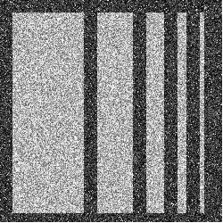
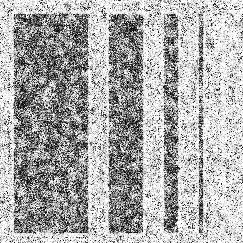
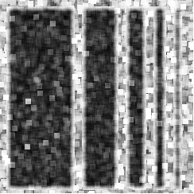
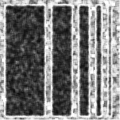
```
```{r sim_SAR_Images_p05, echo=FALSE, message=FALSE, warning=FALSE, out.width="100%", fig.show="hold", fig.align="center",fig.pos = 'H', fig.cap='Results of tests on simulated data with a threshold of $0.1$ of the $p$-value. (a) Entropy-based test; (b) CV test; (c) $\\text{CV}_{\\text{MnAD}}$ test.',  fig.subcap=c(' ', ' ',' ' ), out.width = c("40mm", "40mm","40mm"),  fig.ncol=3, fig.width = 20, fig.height = 10}
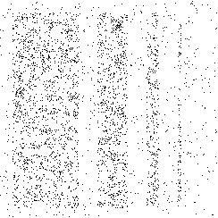
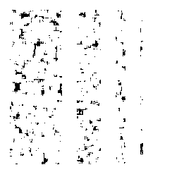
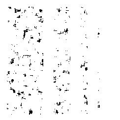

```

## Real Data


We evaluated the proposed test statistic using two real SAR images. 
For our analysis, we used images of the city of Frankfurt, Germany, and of Ottawa, Canada. 
These images were acquired by the Sentinel-1A satellite operating in C-band, with VV polarization, intensity format and
\(L=5\) nominal looks.
Both images have a size of \(512 \times 512\) pixels and contain urban areas, water and forest regions, as shown in  Figures&nbsp;\ref{fig:real_SAR_Images_coe}(a)--(b).

  The $p$-values obtained for the $S_H$, $T_{\text{CV}}$, and $T_{\text{CV}_{\text{MnAD}}}$ tests are presented in Figures&nbsp;\ref{fig:sim_SAR_Images_Frankfurt}--\ref{fig:sim_SAR_Images_01_Ottawa}, respectively. 
  
In general, using the original and robust CV is more meaningful than using Shannon entropy to capture texturelessness.
It is justified that the dark areas of the maps based on the $\text{CV}$ and $\text{CV}_{\text{MnAD}}$ tests cover the areas reported for the Shannon entropy-based map.
Both CV-based tools predicted textureless regions as well as boundaries where the statistical properties of texture vary.
Assuming $10\%$ as the threshold for the $p$ values, the dark region produced by the $\text{CV}$ test was higher than that produced by the $\text{CV}_{\text{MnAD}}$ and entropy test.
The latter observation is to be expected as the latter tests are robust alternatives to the former test, which is essentially based on the expected value operator that reacts to outliers.

```{r real_SAR_Images_coe, echo=FALSE, message=FALSE, warning=FALSE, out.width="100%", fig.show="hold", fig.align="center",fig.pos = 'H', fig.cap='SAR images. (a) Frankfurt; (b) Ottawa. ',  fig.subcap=c(' ', ' ',' ' ), out.width = c("40mm", "40mm"),  fig.ncol=2, fig.width = 20, fig.height = 10}
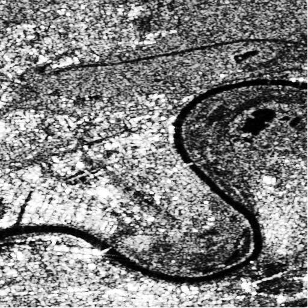
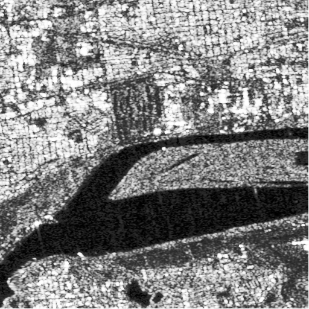
#

```
```{r sim_SAR_Images_Frankfurt, echo=FALSE, message=FALSE, warning=FALSE, out.width="100%", fig.show="hold", fig.align="center",fig.pos = 'H', fig.cap='Results of applying the test statistics in Frankfurt image. (a) $P$-values from the entropy-based test; (b) $P$-values from the CV test; (c) $P$-values from the   $\\text{CV}_{\\text{MnAD}}$ test. ',  fig.subcap=c(' ', ' ',' ' ), out.width = c("40mm", "40mm","40mm"),  fig.ncol=3, fig.width = 20, fig.height = 10}
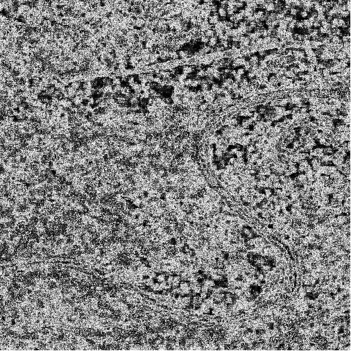
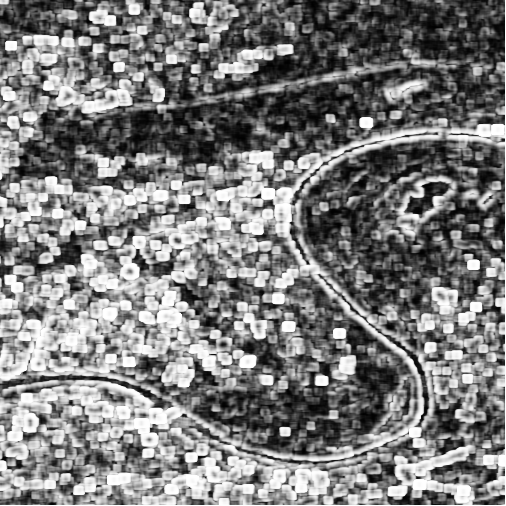


```
```{r sim_SAR_Images_01Frankfurt, echo=FALSE, message=FALSE, warning=FALSE, out.width="100%", fig.show="hold", fig.align="center",fig.pos = 'H', fig.cap='Test results with a threshold of $0.1$ of the $p$-value for the Frankfurt image. (a) Entropy-based test; (b) CV test; (c) $\\text{CV}_{\\text{MnAD}}$ test.',  fig.subcap=c(' ', ' ',' ' ), out.width = c("40mm", "40mm","40mm"),  fig.ncol=3, fig.width = 20, fig.height = 10}
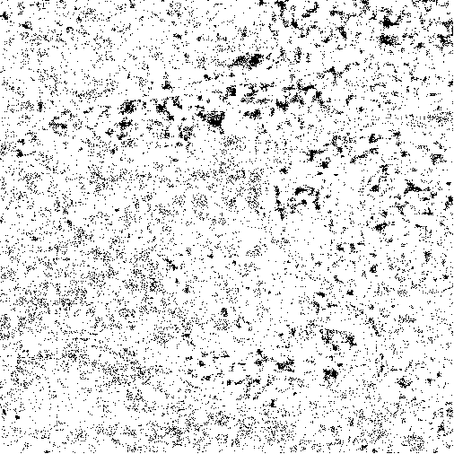
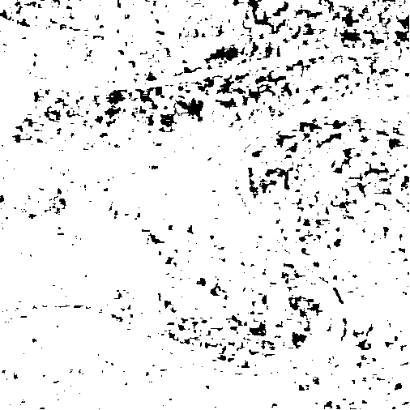
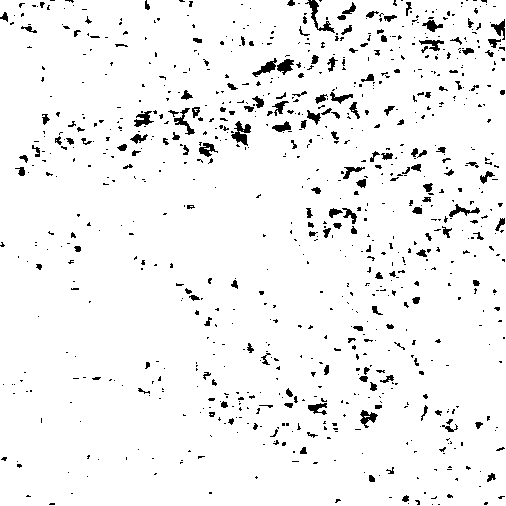

```


```{r sim_SAR_Images_Ottawa, echo=FALSE, message=FALSE, warning=FALSE, out.width="100%", fig.show="hold", fig.align="center",fig.pos = 'H', fig.cap='Results of applying the test statistics in Ottawa image. (a) $P$-values from the entropy-based test; (b) $P$-values from the CV test; (c) $P$-values from the   $\\text{CV}_{\\text{MnAD}}$ test.',  fig.subcap=c(' ', ' ',' ' ), out.width = c("40mm", "40mm","40mm"),  fig.ncol=3, fig.width = 20, fig.height = 10}
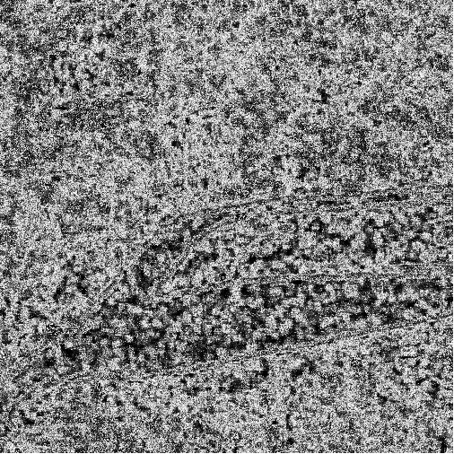
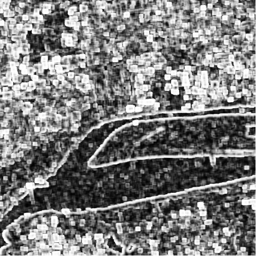


```
```{r sim_SAR_Images_01_Ottawa, echo=FALSE, message=FALSE, warning=FALSE, out.width="100%", fig.show="hold", fig.align="center",fig.pos = 'H', fig.cap='Test results with a threshold of $0.1$ of the $p$-value for the Ottawa image. (a) Entropy-based test; (b) CV test; (c) $\\text{CV}_{\\text{MnAD}}$ test.',  fig.subcap=c(' ', ' ',' ' ), out.width = c("40mm", "40mm","40mm"),  fig.ncol=3, fig.width = 20, fig.height = 10}
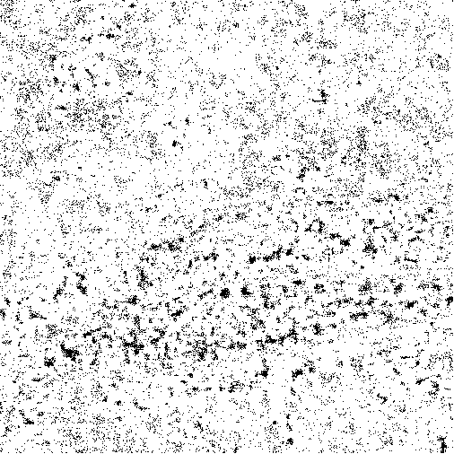
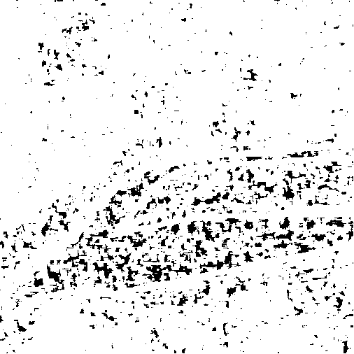
knitr::include_graphics("../Figures/PNG/Ottawa_512_mnad_7_0.1.png")

```


# Conclusion {#sec:conclusion} 

In this article, we have provided a practical and theoretical answer to the following physical question: How to detect texturelessness in SAR images, assuming that the SAR intensity follows the $\mathcal{G}^0_I$ distribution.
Solving this problem is not easy, considering that the texturelessness in the parametric space of $\mathcal{G}^0_I$ means the infinity value, which is neither analytically tractable nor practically provable.
To this end, we proposed three novel hypothesis tests, one from the Shannon entropy and two others from the variation coefficient variants.
The performance of our proposals was evaluated using a Monte Carlo study. 
The results showed that they were conservative in estimating the probability of a type I error (false alarm rate) and the test power (probability of detection), which increases with sample size.
An application to two recent SAR images was performed. 
The results showed that the $\text{CV}_{\text{MnAD}}$ and Shannon entropy-based tests were more robust than the CV-based tests. 
In addition, the CV-based tests were able to recognize both images without texture and those where the type of texture changes.


